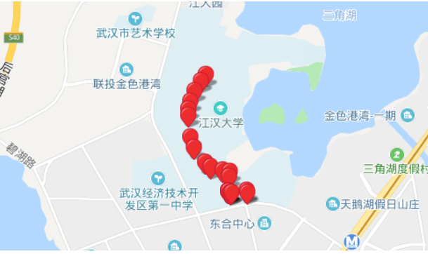

# CargoTracking

## 基于GPS和GPRS的货物实时跟踪系统

一种基于全球定位系统(GPS) 和通用分组无线服务技术(GPRS)的货物实时跟踪系统。采用GPS模块定位货物位置，以三轴传感器作为位置辅助判断工具，以GPRS来传输信息，用STM32F103zet6处理接收的信息，最后在安卓手机上显示。本文从整体上介绍了系统的结构，详细说明了各个模块的功能并提出了实现这些功能的方法，最后对于实际制作过程中所遇到问题及解决方法也进行了深入的探讨。

### 系统总体结构构建

整个系统包括货物（硬件部分），服务器，移动终端（APP）三个部分构成，其中硬件部分和货物一起运输，通过里面的GPS模块进行实时定位。

货物实时跟踪系统硬件的核心内容包括单片机模块，GPS模块和GPRS模块构成，除此之外还包括服务器端和手机客户端APP。

系统整体工作过程如下：硬件装置作为一个整体装在货物上。其中GPS模块获取货物的位置坐标，然后将坐标信息发送给单片机；STM32F103zet6单片机处理完经纬度信息后，再将该信息发给GPRS模块；GPRS模块负责将货物的位置信息传输到基站。再由服务器端存储，使用者能够利用手机APP接受服务器端货物坐标位置并百度地图在手机上显示。

实物装置图

最终效果图

使用了onenet开发平台提供的服务和APP，可以实时在PC和手机上查看定位信息

